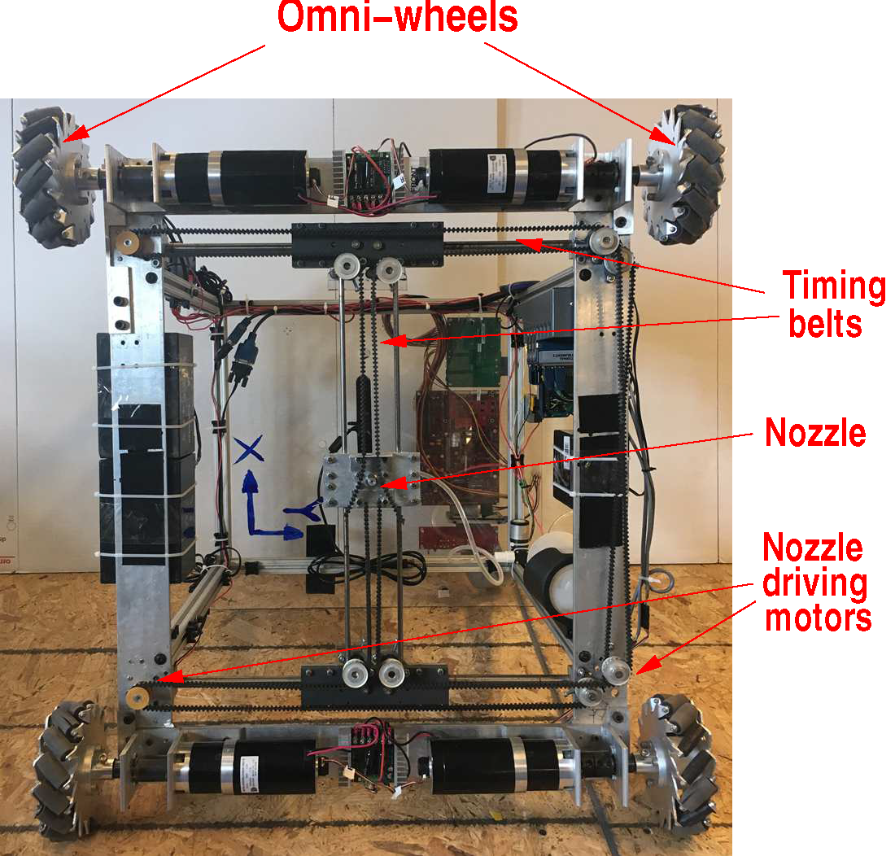
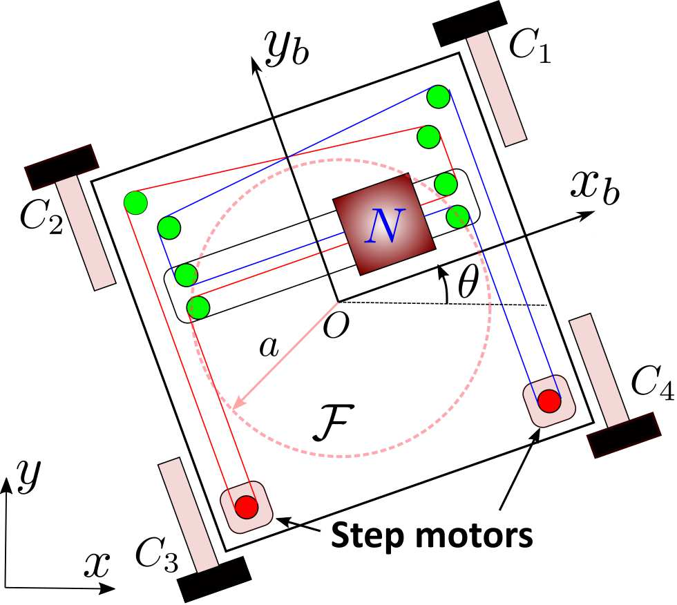

# Crack-Filling-Robot

## Current Hardware Design Overview

### Hardware:
* OnBoard Control Systems:
  * Intel NUC: Embeded Mini PC
  * National Instruments CompactRIO
* Sensors:
  * Stereo Camera (Facing Down)
  * Optical Motion Capturing Sytem
  * Vicon Cameras: 8x Vantage Cameras
* Other:
  * CoreXY Printing System (2x Stepper Motors)
  * 4x 24V DC Motors
  * 4x Meccanum Wheels
### Software:
* MATLAB
* LabVIEW

### Images:

> ||
> |:--:|
> |Fig. 1: Bottom View|

> ||
> |:--:|
> |Fig. 2: ISO View|

> ||
> |:--:|
> |Fig. 3: Schematic View|
