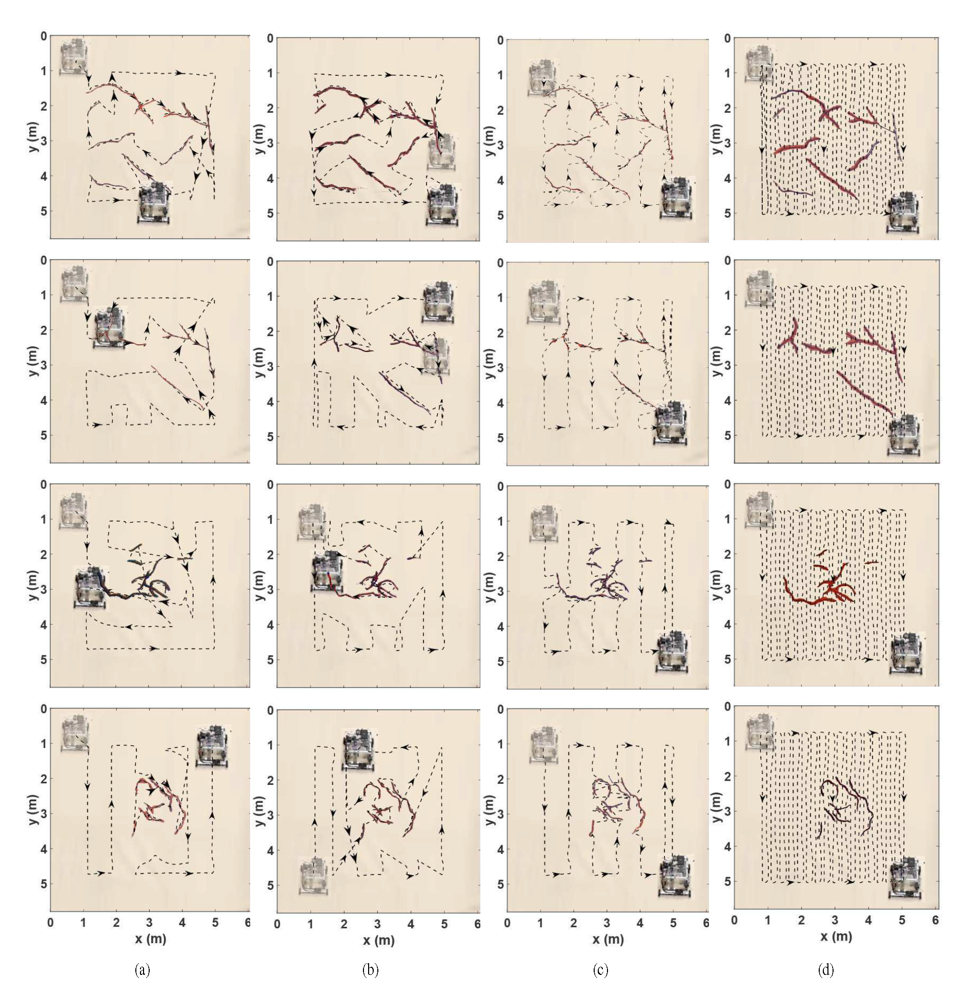

# Complete and Near-Optimal Robotic Crack Coverage and Filling in Civil Infrastructure

V. Veeraraghavan, K. Hunte, J. Yi, and K. Yu (2024). [Complete and Near-Optimal Robotic Crack Coverage and Filling in Civil Infrastructure.](https://ieeexplore.ieee.org/document/10506627) *IEEE Trans. on Robotics*, in press, doi: 10.1109/TRO.2024.3392077.

>
> Video: **Complete and Near-Optimal Robotic Crack Coverage and Filling in Civil Infrastructure** - [YouTube](https://www.youtube.com/watch?v=dcutCBmMGNA)
>
> https://github.com/Binghamton-ACSR-Lab/Crack-Filling-Robot/assets/20301959/0a3533ce-3e36-4509-add9-288500272d4a
> 
> **Illustration of the Algorithm**
> 

## Abstract

We present a simultaneous sensor-based inspection and footprint coverage (SIFC) planning and control design with applications for autonomous robotic crack mapping and filling. The main challenge of the SIFC problem lies in the coupling of complete sensing (for mapping) and robotic footprint (for filling) coverage tasks. Initially, we assume known target information (e.g., cracks) and employ classic cell decomposition methods to achieve complete sensing coverage of the workspace and complete robotic footprint coverage using the least-cost route. Subsequently, we generalize the algorithm to handle unknown target information, allowing the robot to scan and incrementally construct the target map online while conducting robotic footprint coverage. The online polynomial-time SIFC planning algorithm minimizes the total robot traveling distance, guarantees complete sensing coverage of the entire workspace, and achieves near-optimal robotic footprint coverage, as demonstrated through experiments. For the demonstrated application, we design coordinated nozzle motion control with the planned robot trajectory to efficiently fill all cracks within the robot’s footprint. Experimental results illustrate the algorithm’s design, performance, and comparisons. The SIFC algorithm offers a high-efficiency motion planning solution for various robotic applications requiring simultaneous sensing and actuation coverage.

## Algorithm Design Overview

To solve the above SIFC problem, we present a set of algorithmic developments in this paper.

> 

* ### Sensor-based Complete Coverage (SCC)
    We discuss the optimal coverage planning with known cracks in the previous section, and the crack coverage planning algorithm does not consider the sensor coverage. To solve the SIFT problem, we first consider the coverage planning with known target (crack) information. Then, we generalize the algorithm to the case with unknown target information.
* ### online Sensor-based Complete Coverage (oSCC)
    The onlineSCC algorithm is a practical extension of SCC where the robot stores and incrementally constructs the crack graph online. It scans for new cracks in W and updates the crack graph while simultaneously filling it.

## Flow Chart
| | |
|:----:|:----:|
| SCC Flow Chart| SCC Simulation Result |
|  |  |
| oSCC Flow Chart| oSCC Simulation Result |
|  |  |

 

## Experimental Setup

> ||
> |:--|
> |Fig. 1. The omni-directional crack-filling robot with various sensors and actuators. (a) Front view and (b) side view. (c) Indoor experimental setup with optical motion capture system. (d) An illustrative example of the filling error calculation. The crack filling errors are calculated by the center-line differences between the cracks (blue) and the delivered paint (red).|

Fig. 1(a) shows the crack-filling robot prototype, and Fig. 1(b) shows the indoor experimental setup for testing
validation. Instead of building actual cracks in the floor surface, we represented the cracks by drawing crack maps on drop cloths with blue paint. The robot then delivered red paint to cover the drawn cracks to emulate the crack-filling experiments. Using optical markers placed on the top surface of the robot, we obtained the position and orientation of the robot from the motion capture systems (8 Vantage cameras, Vicon Ltd.). Two stepper motors were used to drive the nozzle motion through a timing-belt XY-positioning design. A hydraulic pump and a solenoid valve were used for fluid paint delivery and control through the nozzle. Knowing
the robot's location, the local crack images within the region centered around the robot with a range of S were fed to the planner to emulate the onboard crack detection sensor. The local position of the nozzle in the robot frame was obtained from a stereo camera mounted at the center of the robot pointing downward; see Fig. 1(a). In addition to the nozzle position, the stereo camera provided the location of the unfilled and filled cracks in real-time.

### Follow the link for [Hardware Details](Docs/3.Hardware/3.1_CurrentVersion/README.md)

### Follow the link for [Software Details](Software/README.md)

## Experiment Performance Comparison on Four Crack Maps under Five Planning Algorithms：

 

> ||
> |:--|
> |Fig. 2. The experimental comparison of crack filling outcomes with four crack density and distribution profiles. From the top to the bottom rows, the crack maps are U100, U80, G100, and G20, respectively. Each column represents the experimental results under one motion planning algorithm. The robot’s starting and ending locations are marked by a “shadowed” and an actual robot image, respectively. (a) Results under the oSCC planner, (b) the SCC planner, (c) the Greedy planner, and (d) the ZigZag planner. The blue and red areas represent the cracks and the red paint that was dropped by the robot to cover the cracks. The black dashed lines represent the robot center’s traveling trajectories, and the arrows indicate the motion directions. More details can be found in the companion video clip.|

 

<table style="text-align:center">
  <thead>
    <tr>
      <th> </th>
      <th colspan="4" style="text-align:center">Filling Time (s)</th>
      <th colspan="4" style="text-align:center">Robot Travel Time (s)</th>
      <th colspan="4" style="text-align:center">Robot Path Length (m)</th>
      <th colspan="4" style="text-align:center">Nozzle Path (m)</th>
      <th colspan="4" style="text-align:center">Sensor Coverage (%)</th>
      <th colspan="4" style="text-align:center">Filling Accuracy (%)</th>
    </tr>
    <tr>
      <td > </td>
      <td >U100</td> 
      <td >U80</td>
      <td >G100</td>
      <td >G20</td>
      <td >U100</td> 
      <td >U80</td>
      <td >G100</td>
      <td >G20</td>
      <td >U100</td> 
      <td >U80</td>
      <td >G100</td>
      <td >G20</td>
      <td >U100</td> 
      <td >U80</td>
      <td >G100</td>
      <td >G20</td>
      <td >U100</td> 
      <td >U80</td>
      <td >G100</td>
      <td >G20</td>
      <td >U100</td> 
      <td >U80</td>
      <td >G100</td>
      <td >G20</td>
    </tr>
  </thead>
  <tbody>
    <tr>
      <td style="text-align:left">`onlineSCC`</td>
      <td >731</td> 
      <td ><strong>401</strong></td>
      <td ><strong>356</strong></td>
      <td >346</td>
      <td >1398</td> 
      <td ><strong>937</strong></td>
      <td >952</td>
      <td ><strong>889</strong></td>
      <td ><strong>51</strong> (50)</td> 
      <td ><strong>42</strong> (40)</td>
      <td >52 (45)</td>
      <td ><strong>46</strong> (44)</td>
      <td >26</td> 
      <td ><strong>15</strong></td>
      <td >15</td>
      <td >14</td>
      <td ><strong>131</strong> (129)</td> 
      <td ><strong>109</strong> (103)</td>
      <td >133 (117)</td>
      <td ><strong>119</strong> (114)</td>
      <td >98.9</td> 
      <td >98.9</td>
      <td >98.1</td>
      <td >98.1</td>
    </tr>
    <tr>
      <td style="text-align:left">`SCC`</td>
      <td ><strong>654</strong></td> 
      <td >430</td>
      <td >366</td>
      <td ><strong>345</strong></td>
      <td ><strong>1328</strong></td> 
      <td >975</td>
      <td ><strong>919</strong></td>
      <td ><strong>889</strong></td>
      <td ><strong>51</strong> (48)</td>
      <td >49 (43)</td>
      <td ><strong>49</strong> (46)</td>
      <td >52 (45)</td>
      <td ><strong>23</strong></td> 
      <td >16</td>
      <td ><strong>14</strong></td>
      <td ><strong>12</strong></td>
      <td >132 (123)</td> 
      <td >126 (111)</td>
      <td ><strong>127</strong> (118)</td>
      <td >134 (117)</td>
      <td >99.1</td> 
      <td >99.8</td>
      <td >98.4</td>
      <td >98.4</td>
    </tr>
    <tr>
      <td style="text-align:left">`GCC`</td>
      <td >559</td> 
      <td >364</td>
      <td >273</td>
      <td >276</td>
      <td >914</td> 
      <td >577</td>
      <td >455</td>
      <td >455</td>
      <td >30 (29)</td>
      <td >19 (17)</td>
      <td >15 (13)</td>
      <td >13 (12)</td>
      <td >30</td> 
      <td >20</td>
      <td >14</td>
      <td >12</td>
      <td >58 (60)</td> 
      <td >34 (34)</td>
      <td >24 (24)</td>
      <td >20 (20)</td>
      <td >99.1</td> 
      <td >99.8</td>
      <td >98.4</td>
      <td >98.4</td>
    </tr>
    <tr>
      <td style="text-align:left">`Greedy`</td>
      <td >746</td> 
      <td >446</td>
      <td >414</td>
      <td >372</td>
      <td >1714</td> 
      <td >1228</td>
      <td >1104</td>
      <td >1060</td>
      <td >73 (65)</td>
      <td >63 (53)</td>
      <td >58 (53)</td>
      <td >57 (48)</td>
      <td >29</td> 
      <td >19</td>
      <td >17</td>
      <td >16</td>
      <td >187 (166)</td> 
      <td >163 (137)</td>
      <td >150 (137)</td>
      <td >147 (123)</td>
      <td >99.6</td> 
      <td >99.5</td>
      <td >99.1</td>
      <td >99.1</td>
    </tr>
    <tr>
      <td style="text-align:left">`ZigZag`</td>
      <td >752</td> 
      <td >480</td>
      <td >448</td>
      <td >415</td>
      <td >2611</td> 
      <td >2284</td>
      <td >2149</td>
      <td >2166</td>
      <td >196 (201)</td>
      <td >195 (201)</td>
      <td >195 (201)</td>
      <td >195 (201)</td>
      <td >29</td> 
      <td >19</td>
      <td >16</td>
      <td >18</td>
      <td >504 (517)</td> 
      <td >502 (517)</td>
      <td >501 (517)</td>
      <td >501 (517)</td>
      <td >99.1</td> 
      <td >99.8</td>
      <td >98.4</td>
      <td style="text">98.4</td>
    </tr>
  </tbody>
</table>
