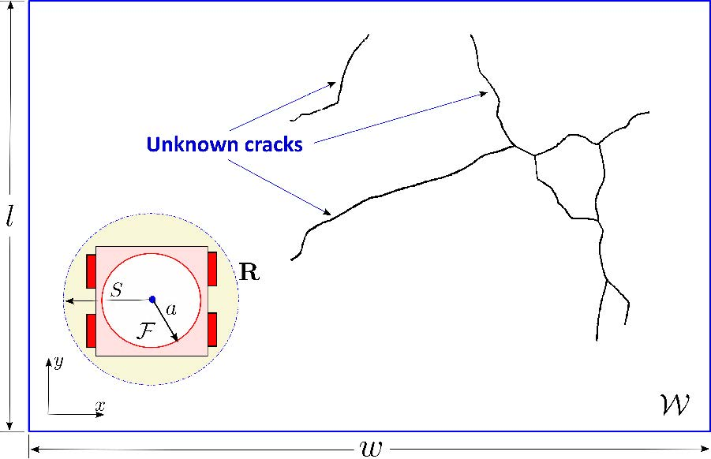
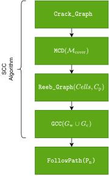
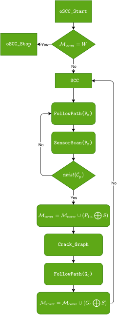
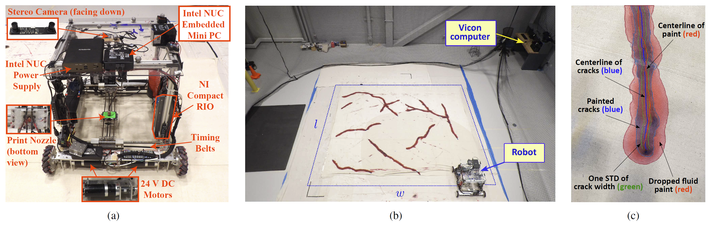

# Crack-Filling-Robot

> **Complete and Near-Optimal Coverage Planning and  Control in Robotic Crack Filling**
>
> Video : [We made a Crack Filling Robot！ - YouTube](https://www.youtube.com/watch?v=VYJV3xwJ_5Y)

> 

## Abstract

We present a simultaneous sensor-based inspection and footprint coverage (SIFC) planning and robotic control design with applications to efficiently detect and fill unknown cracks in civil infrastructure. Surface cracks exist in many civil infrastructures, such as road and bridge deck surfaces, parking plots, etc., and the SIFC design enables a robotic crack detection and repair system. The proposed online sensor-based complete coverage planning minimizes the total traveling distance of the robot, guarantees the complete sensor coverage of the entire workspace, and achieves near-optimal footprint coverage and repairing of all the cracks. The new SIFC algorithm constructs the unknown crack maps and Reeb graphs online. The total distance traveled by the robot is minimized and the resulting near-optimal path is calculated in polynomial time. The onboard motion control is coordinated with the planned robot trajectory to efficiently fill all cracks underneath the robot footprint. Extensive experimental results are presented to demonstrate the system design and performance evaluation. The SIFC design provide a high-efficiency online planning algorithmic solution to infrastructure maintenance and other robotic applications.

## Algorithm Design Overview

To solve the above SIFC problem, we present a set of algorithmic developments in this paper.

> 

* ### Sensor-based Complete Coverage (SCC)
    We discuss the optimal coverage planning with known cracks in the previous section, and the crack coverage planning algorithm does not consider the sensor coverage. In order to solve the SIFT problem, we first consider the coverage planning with known target (crack) information. Then, we generalize the algorithm to the case with unknown target information.
* ### online Sensor-based Complete Coverage (oSCC)
    The onlineSCC algorithm is a practical extension of SCC where the robot stores and incrementally constructs the crack graph online. It scans for new cracks in W and updates the crack graph while simultaneously filling it.

## Flow Chart
| | |
|:----:|:----:|
| SCC Flow Chart| SCC Simulation Result |
|  |  |
| oSCC Flow Chart| oSCC Simulation Result |
|  |  |

 

## Experimental Setup

> ||
> |:--|
> |Fig. 1. The omni-directional crack filling robot with various sensors and actuators. (a) Front view and (b) side view. (c) Indoor experimental setup with optical motion capture system. (d) An illustrative example of the filling error calculation. The crack filling errors are calculated by the center-line differences between the cracks (blue) and the delivered paint (red).|

Fig. 1(a) shows the crack filling robot prototype, and Fig. 1(b) shows the indoor experimental setup for testing
validation. Instead of building actual cracks in the floor surface, we represented the cracks by drawing crack maps on drop cloths with blue paint. The robot then delivered red paint to cover the drawn cracks to emulate the crack filling experiments. Using optical markers placed on the top surface of the robot, we obtained the position and orientation of the robot from the motion capture systems (8 Vantage cameras, Vicon Ltd.). Two stepper motors were used to drive the nozzle motion through a timing-belt XY-positioning design. A hydraulic pump and a solenoid valve were used for fluid paint delivery and control through the nozzle. Having known
the robot location, the local crack images within the region centered around the robot with range of S were fed to the planner to emulate the onboard crack detection sensor. The local position of the nozzle in the robot frame was obtained from a stereo camera mounted at the center of the robot pointing downward; see Fig. 1(a). In addition to the nozzle position, the stereo camera also provided the location of the unfilled and filled cracks in real time.

### Follow the link for [Hardware Details](Docs/3.Hardware/3.1_CurrentVersion/README.md)

## Experiment Performance Comparison on Four Crack Maps under Five Planning Algorithms：

 

<table style="text-align:center">
  <thead>
    <tr>
      <th> </th>
      <th colspan="4" style="text-align:center">Filling Time (s)</th>
      <th colspan="4" style="text-align:center">Robot Travel Time (s)</th>
      <th colspan="4" style="text-align:center">Robot Path Length (m)</th>
      <th colspan="4" style="text-align:center">Nozzle Path (m)</th>
      <th colspan="4" style="text-align:center">Sensor Coverage (%)</th>
      <th colspan="4" style="text-align:center">Filling Accuracy (%)</th>
    </tr>
    <tr>
      <td > </td>
      <td >U100</td> 
      <td >U80</td>
      <td >G100</td>
      <td >G20</td>
      <td >U100</td> 
      <td >U80</td>
      <td >G100</td>
      <td >G20</td>
      <td >U100</td> 
      <td >U80</td>
      <td >G100</td>
      <td >G20</td>
      <td >U100</td> 
      <td >U80</td>
      <td >G100</td>
      <td >G20</td>
      <td >U100</td> 
      <td >U80</td>
      <td >G100</td>
      <td >G20</td>
      <td >U100</td> 
      <td >U80</td>
      <td >G100</td>
      <td >G20</td>
    </tr>
  </thead>
  <tbody>
    <tr>
      <td style="text-align:left">`onlineSCC`</td>
      <td >731</td> 
      <td >401</td>
      <td >356</td>
      <td >346</td>
      <td >1398</td> 
      <td >937</td>
      <td >952</td>
      <td >889</td>
      <td >51 (50)</td> 
      <td >42 (40)</td>
      <td >52 (45)</td>
      <td >46 (44)</td>
      <td >26</td> 
      <td >15</td>
      <td >15</td>
      <td >14</td>
      <td >131 (129)</td> 
      <td >109 (103)</td>
      <td >133 (117)</td>
      <td >119 (114)</td>
      <td >98.9</td> 
      <td >98.9</td>
      <td >98.1</td>
      <td >98.1</td>
    </tr>
    <tr>
      <td style="text-align:left">`SCC`</td>
      <td >654</td> 
      <td >430</td>
      <td >366</td>
      <td >345</td>
      <td >1328</td> 
      <td >975</td>
      <td >919</td>
      <td >889</td>
      <td >51 (48)</td>
      <td >49 (43)</td>
      <td >49 (46)</td>
      <td >52 (45)</td>
      <td >23</td> 
      <td >16</td>
      <td >14</td>
      <td >12</td>
      <td >132 (123)</td> 
      <td >126 (111)</td>
      <td >127 (118)</td>
      <td >134 (117)</td>
      <td >99.1</td> 
      <td >99.8</td>
      <td >98.4</td>
      <td >98.4</td>
    </tr>
    <tr>
      <td style="text-align:left">`GCC`</td>
      <td >559</td> 
      <td >364</td>
      <td >273</td>
      <td >276</td>
      <td >914</td> 
      <td >577</td>
      <td >455</td>
      <td >455</td>
      <td >30 (29)</td>
      <td >19 (17)</td>
      <td >15 (13)</td>
      <td >13 (12)</td>
      <td >30</td> 
      <td >20</td>
      <td >14</td>
      <td >12</td>
      <td >58 (60)</td> 
      <td >34 (34)</td>
      <td >24 (24)</td>
      <td >20 (20)</td>
      <td >99.1</td> 
      <td >99.8</td>
      <td >98.4</td>
      <td >98.4</td>
    </tr>
    <tr>
      <td style="text-align:left">`Greedy`</td>
      <td >746</td> 
      <td >446</td>
      <td >414</td>
      <td >372</td>
      <td >1714</td> 
      <td >1228</td>
      <td >1104</td>
      <td >1060</td>
      <td >73 (65)</td>
      <td >63 (53)</td>
      <td >58 (53)</td>
      <td >57 (48)</td>
      <td >29</td> 
      <td >19</td>
      <td >17</td>
      <td >16</td>
      <td >187 (166)</td> 
      <td >163 (137)</td>
      <td >150 (137)</td>
      <td >147 (123)</td>
      <td >99.6</td> 
      <td >99.5</td>
      <td >99.1</td>
      <td >99.1</td>
    </tr>
    <tr>
      <td style="text-align:left">`ZigZag`</td>
      <td >752</td> 
      <td >480</td>
      <td >448</td>
      <td >415</td>
      <td >2611</td> 
      <td >2284</td>
      <td >2149</td>
      <td >2166</td>
      <td >196 (201)</td>
      <td >195 (201)</td>
      <td >195 (201)</td>
      <td >195 (201)</td>
      <td >29</td> 
      <td >19</td>
      <td >16</td>
      <td >18</td>
      <td >504 (517)</td> 
      <td >502 (517)</td>
      <td >501 (517)</td>
      <td >501 (517)</td>
      <td >99.1</td> 
      <td >99.8</td>
      <td >98.4</td>
      <td style="text">98.4</td>
    </tr>
  </tbody>
</table>
