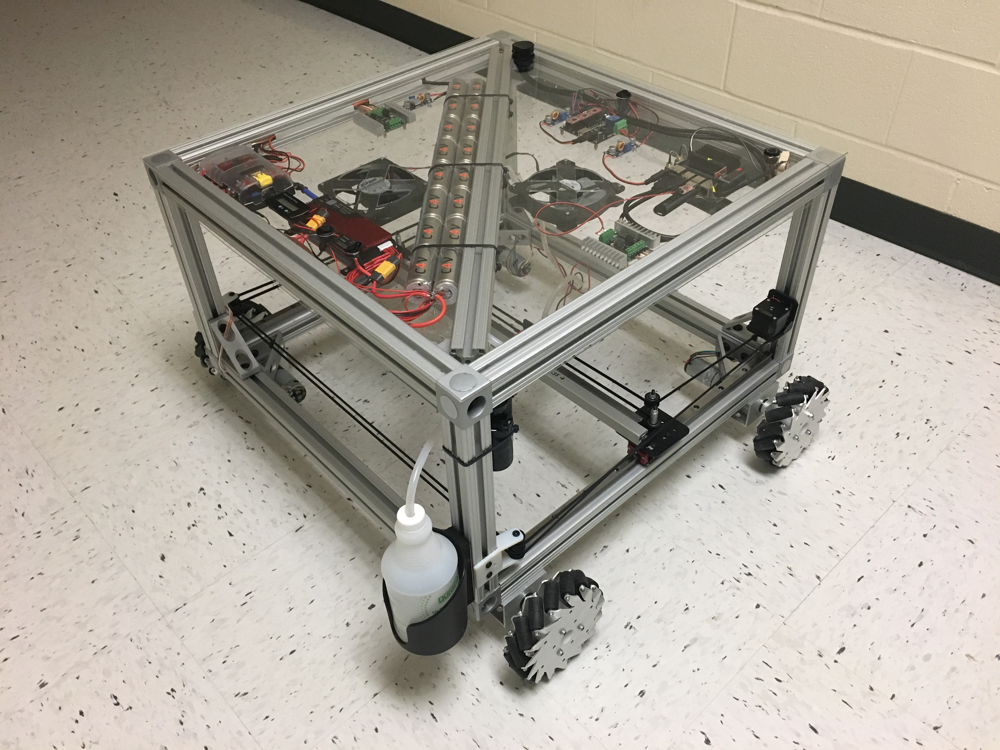
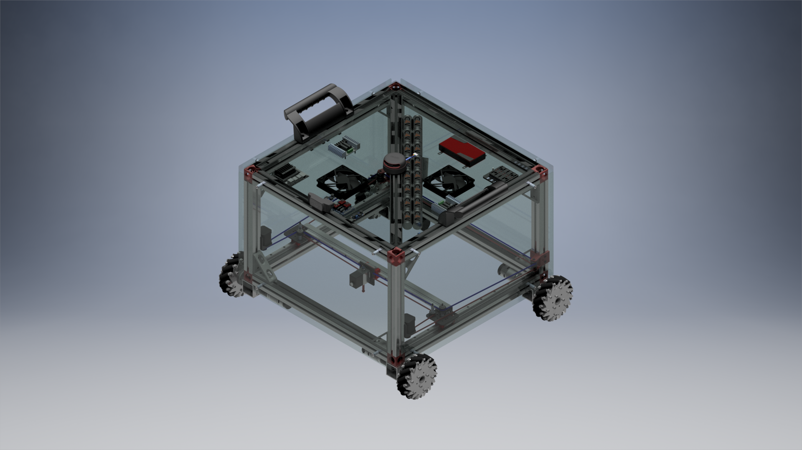
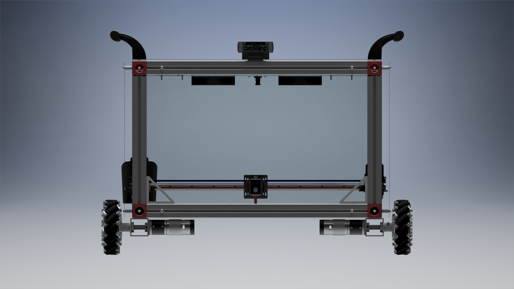
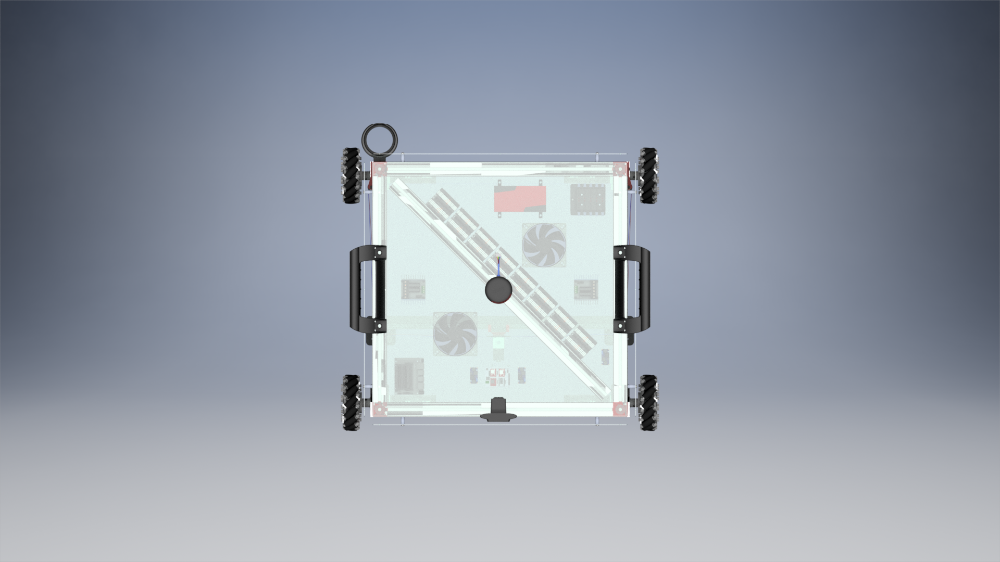
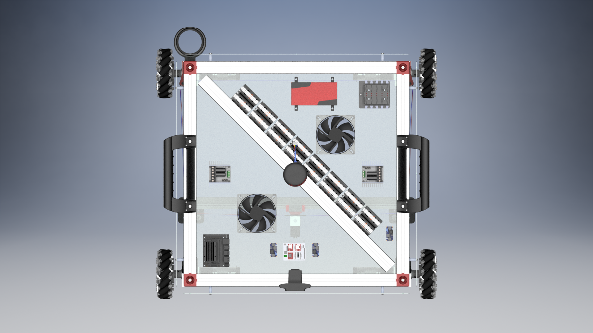

# Crack-Filling-Robot

> **Complete and Near-Optimal Coverage Planning and  Control in Robotic Crack Filling**
>
> Video : [We made a Crack Filling Robot！ - YouTube](https://www.youtube.com/watch?v=VYJV3xwJ_5Y)

> 

 

## Abstract

Surface cracks exist in many civil infrastructure such as road and bridge deck surfaces, parking lots, and building surfaces, etc. To prevent the crack growth and further deterioration, it is necessary to fill these cracks with appropriate materials on time. We present a robotic crack filling system that can effectively and efficiently inspect and deliver fluidic materials to fill all the surface cracks in a specified environment.
Motion planning and cracking filling motion control are the two main tasks presented in this paper. A simultaneous robotic footprint and sensor coverage planning scheme is proposed to efficiently detect all the unknown targets or cracks with range sensors and cover the targets with the robot’s footprint in a structured environment. The proposed online Sensor-based Complete Coverage (online SCC) planning minimizes the total traveling distance of the robot, guarantees the complete sensor coverage of the whole free space, and achieves near-optimal footprint coverage of all the targets. The filling motion control is captured by a model predictive control (MPC) scheme given the mobile platform trajectory. Simulation and experimental results are presented that confirm the efficiency and effectiveness of the proposed scheme.

## Algorithms  

* ### Sensor-based Complete Coverage (SCC)
    We discuss the optimal coverage planning with known cracks in the previous section, and the crack coverage planning algorithm does not consider the sensor coverage. In order to solve the SIFT problem, we first consider the coverage planning with known target (crack) information. Then, we generalize the algorithm to the case with unknown target information.
* ### online Sensor-based Complete Coverage (oSCC)
    The onlineSCC algorithm is a practical extension of SCC where the robot stores and incrementally constructs the crack graph online. It scans for new cracks in W and updates the crack graph while simultaneously filling it.

## Flow Chart
| | |
|:----:|:----:|
| SCC Flow Cahrt| SCC Simulation Result |
|  |  |
| oSCC Flow Cahrt| oSCC Simulation Result |
|  |  |

## Design 

* Jetson Nano
* Lidar

> 
> 
> 
> 
> 

## Performance Comparison for the Configuration in FIG：

|                       | Crack coverage (%) | Overlap (%) | Distance (m) | Time (s) |
| :-------------------- | -----------------: | ----------: | -----------: | -------: |
| Sensor exploration    |               36.5 |      0      | 34.9         | ???      |   
| Footprint coverage    |               100  |      44.5   | 126.4        | ???      |
| `onlineSCC`           |               100  |      18.4   | 41.5         | ???      |
| `SCC`                 |               100  |      14.4   | 40.1         | ???      |
| `onlineSCC` w/o con.  |               100  |      10.5   | 38.7         | ???      |
| `SCC` w/o con.        |               100  |      11.0   | 38.9         | ???      |
| Experiment            |               100  |      23.0   | 48.1         | ???      |

 

> ### ACKNOWLEDGMENT
> The authors thank ...... of Rutgers University for many helpful discussions and suggestions.