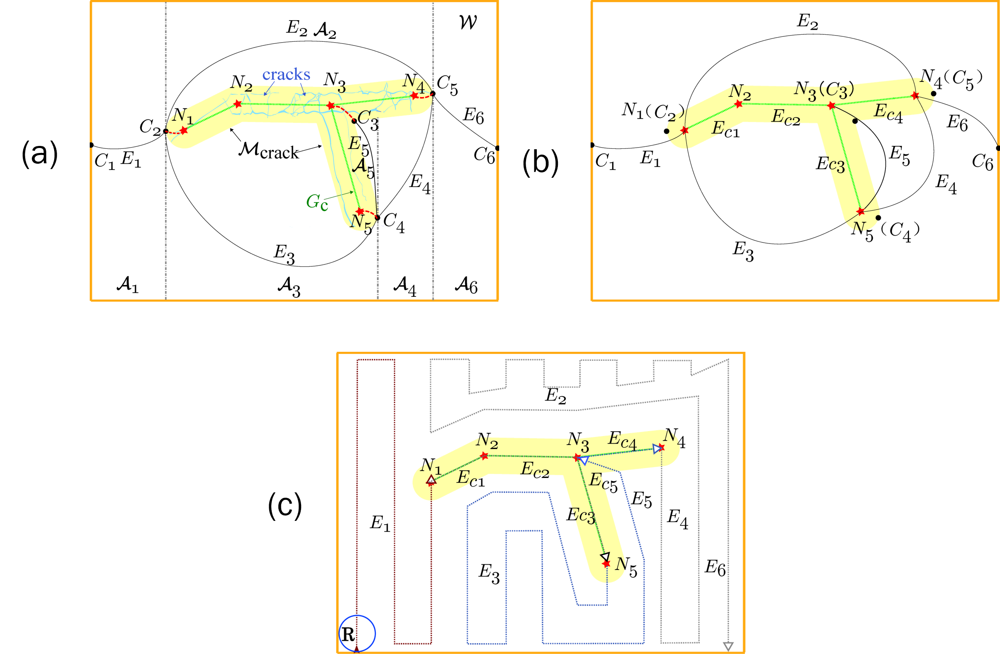

# Crack-Filling-Robot

## Software Overview

### Language used:
* MATLAB R2021a

## Main Functions:
* Algorithms:
  * `SCC.m`
  * `OnlineSCC.m`
  
### SCC 
The SCC algorithm is a Sensor-based Complete Coverage path planner in which we consider that all the target are known to the robot. 

> |<p align="center"> </p>|
> |:--|
The algorithm constructs crack graph for all the known cracks in the workspace, then it computes the MCD and Reeb Graph. The Crack graph and the Reeb graphs are merged and computes a shortest path sequence using the Chinese Postman Problem. Finally, the full coverage path is computed by the Boustrophedon Path planner.  

Run the below command in MATLAB console to execute Sensor-based Complete Coverage (SCC):
```matlab
SCC.m
```

### OnlineSCC 
The onlineSCC algorithm is a practical extension of SCC where the robot stores and incrementally constructs the crack graph online. It scans for new cracks in W and updates the crack graph while simultaneously filling it.
> |<p align="center"> </p>|
> |:--|

Figure above shows all the iterations of the oSCC algorithm. 

Run the below command in MATLAB console to execute online Sensor-based Complete Coverage (oSCC):
```matlab
OnlineSCC.m
```

### Importing Maps to SCC/oSCC Algorithm
We have provided the complete database of Crack Maps used for this project in the [Crack Maps](https://github.com/Binghamton-ACSR-Lab/Crack-Filling-Robot/blob/main/CrackMaps). You can import any map from the database by modifying the lines given below for the respective algorithms. 
#### SCC:
https://github.com/Binghamton-ACSR-Lab/Crack-Filling-Robot/blob/af10dcc612931a204fab9aba4601079fd9bbe5f5/Software/SCC.m#L45-L60
#### oSCC:
https://github.com/Binghamton-ACSR-Lab/Crack-Filling-Robot/blob/86b35710caca81f8262db5b84e2d2e888c818e18/Software/OnlineSCC.m#L56-L68

## Slave Functions:
* Funtions:
  * `MCD.m`
  * `Reed.m`
  * `ReebPath.m`
  * `ReebPath2.m`
  * `Boustrophedon.m`
  * `Boustrophedon_CellCon.m` 
  * `BoustrophedonPath.m`
  * `ChinesePostMan.m`
  * `Image_Planning_Func.m`

### Image Planning 
The first step for the Robot is to extract the cracks from an RGB image of the surface cracks. The `Image_Planning_Func.m` converts the RGB image into Binary image, then skeletonizes the cracks and traces the to extract the cracks and their metadata.
> |<p align="center"> </p><p>Crack Image Credit: W. Wang, M. Wang, H. Li, H. Zhao, K. Wang, C. He, J. Wang, S. Zheng, J. Chen, “Pavement crack image acquisition methods and crack extraction algorithms: A review,†J. Traf. and Transp. Eng., vol. 6, no. 6, pp. 535-556, 1992. </p> <sub>https://doi.org/10.1016/j.jtte.2019.10.001 </sub>|
> |:--|
> |Fig. 1. Before (a, b, c) and after (d, e, f) images of Image Processing.|

Figure 1. Shows the output in binary form extracted from an RGB image.

The `Image_Planning_Func.m` also computes the Minkowski Sum over the cracks extracted and then computes the `crackGraph` using the Visibility Graph algorithm. 

> |<p align="center">  </p>|
> |:--|
> |Fig. 2. Illustration of process steps in the Image Planning function.|

The image planning is performed differently between onlineSCC and SCC. For SCC, the algorithm computes the image planning for the entire workspace with all crack information. For onlineSCC, the algorithm computes the image planning only for the sensor range in a loop as the robot scans and fill the cracks online. 

#### Image Planning for onlineSCC:
```matlab
function [waypoint_coords,flag,crackR,ttt] = image_planning_func_oSCC(BW3,a,s,cp,acp,endP,realEndP,contEndP,ppath,preCrack)
%
% Performs Image processing, extacts cracks and metadata, and computes the waypoints for the crackGraph using Visibility Graph.
%
% INPUTS:
%   BW3 = Binary image of the sensor range. 
%   a = Footprint Range. 
%   s = Sensor Range.
%   cp = Simulated current point.
%   acp = Actual currnt point. 
%   endP = [x0; y0] = All enpoints of the extracted cracks.
%   realEndP = [x0; y0] = Real enpoints in endP. 
%   contEndP = [x0; y0] = Continuing enpoints in endP.
%   ppath = [x0; y0] = Path of the robot from start to current iteration. 
%   preCrack = [x0; y0] = Scanned craks from previous iteration. 
%
% OUTPUTS:
%   waypoint_coords = [x0; y0] = Waypoint coordinates of the crackGraph. 
%   flag = high if robot is curently filling, low if robot is just trasversing.
%   crackR = [x0; y0] = Scanned craks from current iteration.
%   ttt = Computation time.
```
#### Image Planning for SCC: 
```matlab
function [node,edgeList,ttt]=Image_planning_func_SCC(img_n)
%
% Performs Image processing, extacts cracks and metadata, and computes the waypoints for the crackGraph using Visibility Graph.
%
% INPUTS:
%   img_n = RGB or Binary image of the workspace. 
%
% OUTPUTS:
%   node = [x0; y0] = nodes list of all edges in crackGraph in undirected graph format. 
%   edgeList = [node1; node2] = edges list of all edges in crackGraph in undirected graph format.
%   ttt = Computation time.
```


### MCD
Morce Cell Decomposition (MCD) is one of the Cellular Decomposition Methods. It is used to identify the critical points in the workspace and decompose the complex workspace into multiple simple cells. A ‘Slice’ is a vertical line that is swept from left to right and connectivity changes are recorded.

> |<p align="center">  </p>|
> |:--|
> |Fig. 3. Illustration of the Morse-based cellular decomposition (MCD) with a one-edge crack graph. 𝐴<sub>𝑖</sub> , 𝐶<sub>𝑖</sub> and 𝐸<sub>𝑖</sub> represent cells, nodes (i.e., critical points) and edges of the Reeb graph, respectively.|

For example, the slice line shown in the image is swept from left to right, as the slice line is swept in this region the connectivity is 1, and as it sweeps over an obstacle or a target region the line splits in to two thus the connectivity is two and then again it becomes one.

The places where the changes occur are marked as a critical point and the cells are split at those points. After performing MCD we have 𝐶<sub>*1*</sub> – 𝐶<sub>*4*</sub>, and 𝐴<sub>*1*</sub>-𝐴<sub>*4*</sub>


```matlab
function [critPT,polyout_work,polyout,splitEdge]=MCD(polyin_buffed,polyin_work,polyin,nodeend,flag)
%
% Computes a Morse Decomposition of the workspace. 
%
% INPUTS:
%   polyin_buffed = Polygon in the shape of the workspace with a minkowski sum of 'a'.  
%   polyin_work = Polygon in the shape of the workspace, working. 
%   polyin = Polygon in the shape of the workspace.
%   nodeend = Current Position of the robot. 
%   flag = Flag to smooth the edges of the imput polygon. 
%
% OUTPUTS:
%   critPT = Critcal points in the workspace. 
%   polyout_work = Decomposed cells in the workspace. 
%   polyout = Decomposed cells in the workspace.
%   splitEdge = Splitline at the critial points. 
```


### Reeb

A Reeb graph represent the topology of the cellular decomposition, which is illustrated in Figure 1. with edges 𝐸<sub>*1*</sub> - 𝐸<sub>*4*</sub>. It defines the connectivity of the decomposed cells in the workspace, where the nodes represent the critical points and the edges represent their respective cells.

#### Reeb:
Computes a reeb graph from the decomposed cells from Morse cell decomposition.
```matlab
function [reebEdge,reebCell,reeb,reebwall,remreg]=Reeb(polyinreg,critP,splitEdge)                             
%
% Computes a reeb graph from the decomposed cells. 
%
% INPUTS:
%   polyinreg = Variable containing all cells in polygon format.  
%   critP = [x1; y1] = Critical points in the workspace.  
%   splitEdge = Splitline at the critial points. 
%
% OUTPUTS:
%   reebEdge = Computed reeb edges. 
%   reebCell = Decomposed cells in the workspace sorted by reebEdge
%   reeb = Reeb edge curves for plotting. 
%   reebwall = Wall follow Reeb edge curves for plotting. 
%   remreg = polygons that are false positives.
```
#### ReebPath:
Computes a reebPath of all connected cells in sequential order to achieve complete coverage minimizing the overlapping.
```matlab
function [Path,wall_fol,adj]=ReebPath(adj,critP,reebEdge,cells,Start)
%
% Computes a reebPath of all connected cells in sequential order to achieve complete coverage minimizing the overlapping. 
%
% INPUTS:
%   adj = Adjacent matrix explaining the connectivity of edges in the Reeb graph. 
%   critP = [x0; y0] = Current node in coordinate points. 
%   reebEdge = Reeb edges.
%   cells = Reeb cells.
%   Start = Starting node. 
%
% OUTPUTS:
%   Path = reebPath used to compute the final path. 
%   wall_fol = Gives the edges with 1 connectivity. Used for determining wall follow. 
%   adj = Adjacent matrix explaining the connectivity of edges in the Reeb graph.
```
#### ReebPath2:
Computes a reebPath of disconnected cells in sequential order to achieve complete coverage minimizing the overlapping.
```matlab
function [reebEdge,reebCell,reeb,reebwall,remreg]=ReebPath2(polyinreg,critP,splitEdge)                            
%
% Computes a reebPath of disconnected cells in sequential order to achieve complete coverage minimizing the overlapping. 
%
% INPUTS:
%   adj = Adjacent matrix explaining the connectivity of edges in the Reeb graph. 
%   critP = [x0; y0] = Current node in coordinate points. 
%   reebEdge = Reeb edges.
%   cells = Reeb cells.
%   Start = Starting node. 
%
% OUTPUTS:
%   Path = reebPath used to compute the final path. 
%   wall_fol = Gives the edges with 1 connectivity. Used for determining wall follow. 
%   adj = Adjacent matrix explaining the connectivity of edges in the Reeb graph.
```

### Boustrophedon Path Planning
Boustrophedon path planner is a complete coverage path planner that generates a zigzag path for the given cell while achieving a complete coverage. This function computes a zigzag path of cells following the node sequence in the input variable Path.

```matlab
function PathEdge = Boustrophedon(Path,splitReg,see,seP,init,wall_fol,known,sim)
%
% Boustrophedon path planner is a complete coverage path planner that generates a zigzag path 
% for the given cell while achieving a complete coverage. 
% This function computes a zigzag path of cells following the node sequence in the input variable Path. 
%
% INPUTS:
%   Path = Pre-computed path sequence. 
%   splitReg = Decomposed cell in polygons. 
%   see = Variable containing path direction for each cell.  
%   seP = Variable containing start and end point coordinated of all edges in Reeb graph.
%   init = Current position of the Robot. 
%   wall_fol = Gives the index of cells that require a wall follow.
%   known = Flag for SCC
%   sim = Flag for simulation. 
%
% OUTPUTS:
%   PathEdge = Final path generated containing coordinate points in a sequential order.
```
Boustrophedon_CellCon is same as Boustrophedon function with a added Cell connection feature. When the input workspace consist of disjoint cell decomposition the cell connection feature first connects the disjoint cells using a global shortest distance and then computes the boustrophedon path for the individual cells.
```matlab
function PathEdge = Boustrophedon_CellCon(Path,splitReg,see,seP,init,wall_fol,known,sim)                             
%
% Boustrophedon_CellCon path planner is a complete coverage path planner that generates a zigzag path for the given cell while achieving a complete coverage. 
% This function computes a zigzag path of cells following the node sequence in the input variable Path. 
% Same as Boustrophedon function with a added Cell connection feature. When the input workspace consist of disjoint cell decomposition the cell connection feature
% first connects the disjoint cells using a global shortest distance and then computes the boustrophedon path for the individual cells. 
%
% INPUTS:
%   Path = Pre-computed path sequence. 
%   splitReg = Decomposed cell in polygons. 
%   see = Variable containing path direction for each cell.  
%   seP = Variable containing start and end point coordinated of all edges in Reeb graph.
%   init = Current position of the Robot. 
%   wall_fol = Gives the index of cells that require a wall follow.
%   known = Flag for SCC
%   sim = Flag for simulation. 
%
% OUTPUTS:
%   PathEdge = Final path generated containing coordinate points in a sequential order.
```
BoustrophedonPath is a simple path generation function that analyses the topology of individual cells in the workspace and generates a zigzag path within the cell. 
```matlab
function [subXY,flag] = BoustrophedonPath(cell,orgcell,reebEdge,bp_gap,dir,init,wall_fol,known,fl_see)
%
% BoustrophedonPath is a simple path generation function that analyses the topology of individual 
% cells in the workspace and generates a zigzag path within the cell. 
%
% INPUTS:
%   cell = Single cell from the decomposed workspace with a negative footprint Minkowski sum, in polygon. 
%   orgcell = Single cell from the decomposed workspace, in polygon. 
%   reebEdge = Reeb edge of the cell from Reeb Graph.  
%   bp_gap = Spacing between the vertical lines in the zigzag path, sensor range.
%   dir = Variable containing path direction for each cell.
%   init = Current position of the Robot. 
%   wall_fol =  Flag for wall follow.
%   known = Flag for SCC. 
%   fl_see = Flag for simulation.
%
% OUTPUTS:
%   subXY = Final path generated containing coordinate points in a sequential order.
%   flag = Flag for simulation.
```

### ChinesePostMan
Chinese Postman Problem is a variation of Eulerian circuit problem for undirected graphs. An Euler Circuit is a closed walk that covers every edge once starting and ending position is same. Chinese Postman problem is defined for connected and undirected graph. The problem is to find shortest path or circuity that visits every edge of the graph at least once. 
> |<p align="center">  </p>|
> |:--|
> |Fig. 4. Illustration of solving a simple Chinese Postman Problem.|
```matlab
function [Path,Weight,add,st] = ChinesePostman(ADJ,Matrix_Input, DIST, Start, ee, cl)
%
% Function to compute a Chinese Postman Problem using Linear Programming Matching.  
%
% INPUTS:
%   ADJ = Adjacency matrix representing a the graph as a matrix of booleans (0's and 1's). 
%   Matrix_Input = ADJ*DIST 
%   DIST = Matrix contains the distance information of each edges in the graph. 
%   Start = Start node for path.
%   ee = Edges to be removed from the path planner. 
%   cl = node that is closest to the robot. 
%
% OUTPUTS:
%   Path = Final path containing node sequence for edge transversing to achieve shortest path. 
%   Weight = Total Weight of the final Path. 
%   add = New edges to be added. 
%   st = Edge to be removed, largest connecting edge. function [Path,Weight,add,st] = ChinesePostman(ADJ,Matrix_Input, DIST, Start, ee, cl)
```